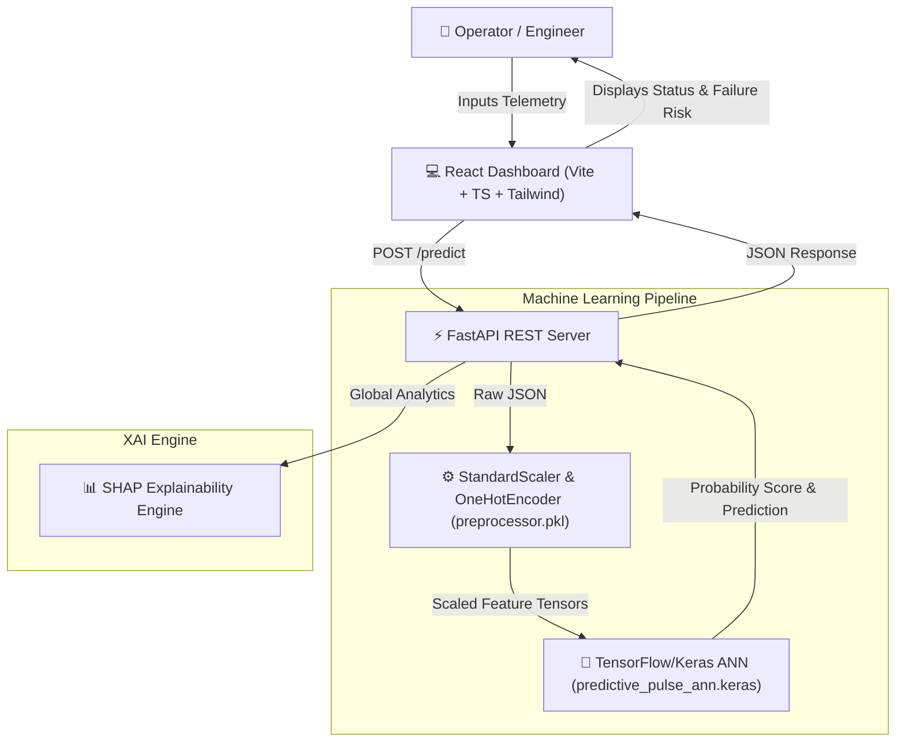

# ⚡ PredictivePulse — AI-Powered Industrial Predictive Maintenance

[](https://www.python.org/)
[](https://fastapi.tiangolo.com/)
[](https://reactjs.org/)
[](https://www.tensorflow.org/)
[](https://tailwindcss.com/)

**PredictivePulse** is an end-to-end Machine Learning & Artificial Intelligence system designed for manufacturing and industrial internet of things (IIoT) applications. It continuous monitors sensor telemetry (temperature, rotational speed, torque, tool wear) and predicts machine failures proactively before costly breakdowns occur.

---

## 🌟 Key Features

- **🤖 Deep Neural Network (ANN):** Trained on 10,000 industrial machine operational logs (UCI AI4I Dataset) using TensorFlow/Keras.
- **⚡ High-Performance REST API:** Low-latency FastAPI inference service with automatic request validation.
- **📊 Explainable AI (SHAP):** Integrates SHAP (SHapley Additive exPlanations) for transparent model decision interpretation.
- **💻 Modern React Dashboard:** Vite + React + TypeScript + Tailwind CSS user interface with interactive sensor sliders, real-time risk gauges, and dark mode styling.
- **⚖️ Balanced Class Weighting:** Handles extreme real-world dataset imbalance (~3.4% failure rate) effectively.

---

## 🎯 What We Are Predicting

PredictivePulse analyzes 6 continuous and categorical sensor variables to predict **Machine Operational Risk**:

- **Target Output:**
  - `0` 🟢 **Normal:** Machine operates within safe parameters.
  - `1` 🔴 **Potential Failure:** Immediate maintenance required.
- **Risk Score:** Continuous failure probability score (`0.0%` to `100.0%`).

### Sensor Parameters & Ranges

| Parameter | Unit | Description | Normal Range |
| :--- | :--- | :--- | :--- |
| **Product Quality Type** | Category | Product quality tier: **L** (Low - 50%), **M** (Medium - 30%), **H** (High - 20%) | `L`, `M`, or `H` |
| **Air Temperature** | Kelvin (`K`) | Ambient factory temperature | `295.0 K` – `304.0 K` |
| **Process Temperature** | Kelvin (`K`) | Operational process heat | `305.0 K` – `313.0 K` |
| **Rotational Speed** | `rpm` | Spindle motor speed | `1168` – `2886 rpm` |
| **Torque** | `Nm` | Rotational torque force | `3.8` – `76.6 Nm` |
| **Tool Wear** | `min` | Cumulative cutting tool usage time | `0` – `253 min` |

---

## 🏗️ System Architecture



---

## 🛠️ Tech Stack & Libraries

- **Frontend:** React 18, TypeScript, Vite, Tailwind CSS, Lucide React Icons
- **Backend:** FastAPI, Uvicorn, Pydantic, Scikit-Learn
- **Machine Learning & Deep Learning:** TensorFlow / Keras, NumPy, Pandas, Joblib
- **Explainable AI:** SHAP, Matplotlib, Seaborn
- **Dataset:** [UCI AI4I 2020 Predictive Maintenance Dataset](https://archive.ics.uci.edu/ml/datasets/AI4I+2020+Predictive+Maintenance+Dataset)

---

## 🚀 Quick Start Guide

### Prerequisites
- **Python 3.10+**
- **Node.js 18+** & `npm`

---

### 1. Backend Setup (FastAPI)

```powershell
# Navigate to project root
cd PredictivePulse-master

# Activate virtual environment (Windows)
.venv\Scripts\activate

# Install dependencies (if needed)
pip install -r backend/requirements.txt

# Start FastAPI server on port 8001
uvicorn backend.main:app --port 8001 --reload
```
- **Backend API:** `http://localhost:8001`
- **Swagger Docs:** `http://localhost:8001/docs`

---

### 2. Frontend Setup (React + Vite)

```powershell
# Open a new terminal and navigate to frontend
cd frontend

# Install dependencies
npm install

# Start Vite dev server
npm run dev
```
- **Dashboard UI:** `http://localhost:5173`

---

## 🔬 Model Training & Evaluation Pipeline

To retrain the Artificial Neural Network or re-generate SHAP explainability plots:

```powershell
# Step 1: Preprocess Dataset
python src/01_data_analysis.py

# Step 2: Train Artificial Neural Network
python src/02_model_training.py

# Step 3: Run Model Evaluation & SHAP Analysis
python src/03_model_evaluation.py
```


